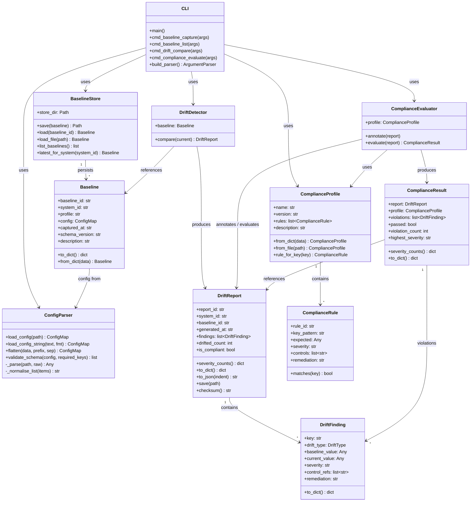
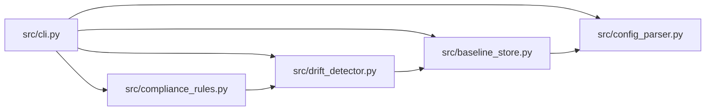

# Component Architecture Diagram

<!-- SPDX-License-Identifier: Apache-2.0 -->
<!-- Copyright 2024 Aerlix Consulting -->

This diagram shows the internal component structure of the Secure Baseline Drift Detection system and the relationships between modules.

---

## Module Dependencies

---

## Component Descriptions

| Component | Module | Responsibility |
|---|---|---|
| CLI | `cli.py` | Entry point, argument parsing, orchestration |
| Config Parser | `config_parser.py` | File I/O, flattening, schema validation |
| Baseline Store | `baseline_store.py` | Baseline persistence and retrieval |
| Baseline | `baseline_store.Baseline` | Data model for a baseline snapshot |
| Drift Detector | `drift_detector.py` | Configuration comparison and finding generation |
| Drift Report | `drift_detector.DriftReport` | Aggregated comparison results |
| Drift Finding | `drift_detector.DriftFinding` | Single configuration difference record |
| Compliance Profile | `compliance_rules.ComplianceProfile` | Loaded rule set |
| Compliance Rule | `compliance_rules.ComplianceRule` | Single policy assertion with glob matching |
| Compliance Evaluator | `compliance_rules.ComplianceEvaluator` | Rule evaluation and severity annotation |
| Compliance Result | `compliance_rules.ComplianceResult` | Final compliance posture output |
