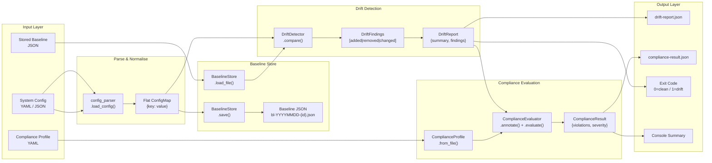
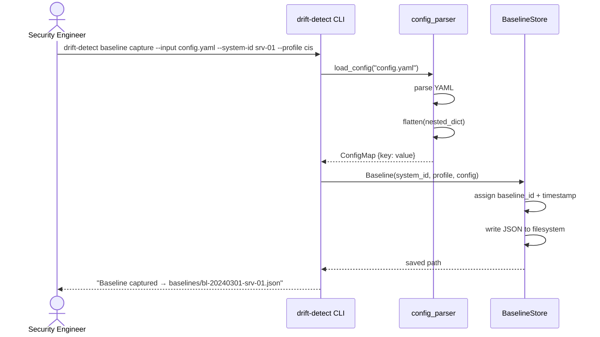
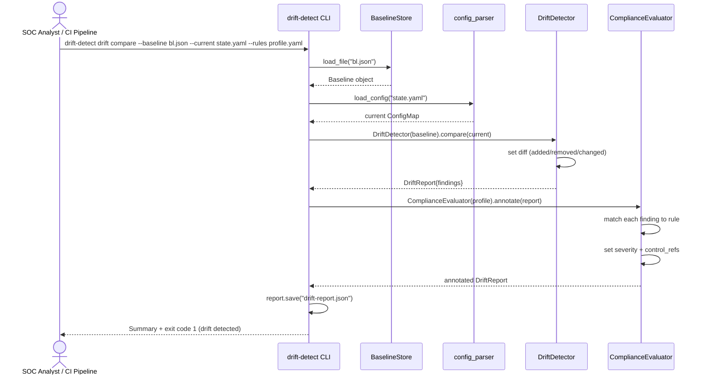

# Data Flow Diagram

<!-- SPDX-License-Identifier: Apache-2.0 -->
<!-- Copyright 2024 Aerlix Consulting -->

This diagram traces the flow of data through the Secure Baseline Drift Detection pipeline from raw configuration input to compliance-evaluated output.

## End-to-End Pipeline



---

## Baseline Capture Data Flow



---

## Drift Detection Data Flow



---

## Data Schema

### Baseline JSON Schema

```
{
  schema_version: "1.0",
  baseline_id: "bl-{YYYYMMDD}-{system-id}",
  system_id: string,
  profile: string,
  captured_at: ISO-8601 timestamp,
  description: string,
  config: {
    "{dotted.path.key}": scalar_value,
    ...
  }
}
```

### Drift Report JSON Schema

```
{
  report_id: "dr-{YYYYMMDD}-{system-id}",
  system_id: string,
  baseline_id: string,
  generated_at: ISO-8601 timestamp,
  summary: {
    total_checks: int,
    drifted: int,
    compliant: int,
    critical: int,
    high: int,
    medium: int,
    low: int,
    unknown: int
  },
  findings: [
    {
      key: string,
      drift_type: "added" | "removed" | "changed",
      baseline_value: any,
      current_value: any,
      severity: "critical" | "high" | "medium" | "low" | "unknown",
      control_refs: [string, ...],
      remediation: string
    }
  ]
}
```
