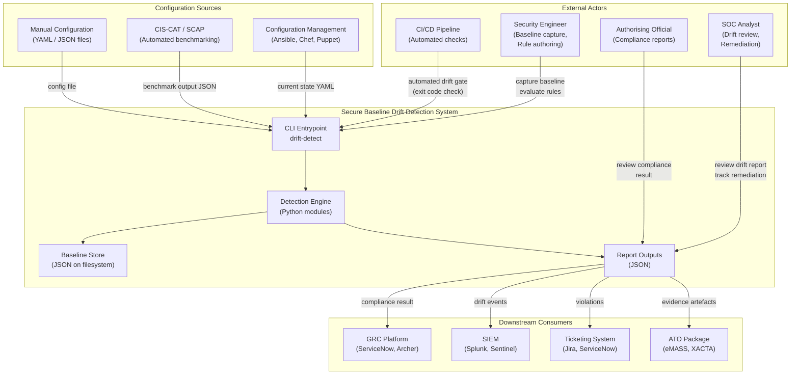

# System Context Diagram

<!-- SPDX-License-Identifier: Apache-2.0 -->
<!-- Copyright 2024 Aerlix Consulting -->

This diagram shows the Secure Baseline Drift Detection system in the context of the external actors and systems it interacts with.

---

## Actor Descriptions

| Actor | Role |
|---|---|
| Security Engineer | Authors compliance profiles, captures initial baselines post-hardening |
| SOC Analyst | Monitors drift reports, initiates remediation workflows |
| Authorising Official | Reviews compliance posture reports for ATO decisions |
| CI/CD Pipeline | Runs drift checks as quality gates in deployment pipelines |
| Configuration Management | Provides live system configuration as input |
| GRC Platform | Consumes compliance results for risk register and POA&M tracking |
| SIEM | Ingests drift events for alerting and correlation |
| ATO Package | Receives evidence artefacts (baseline JSON, drift reports) |
