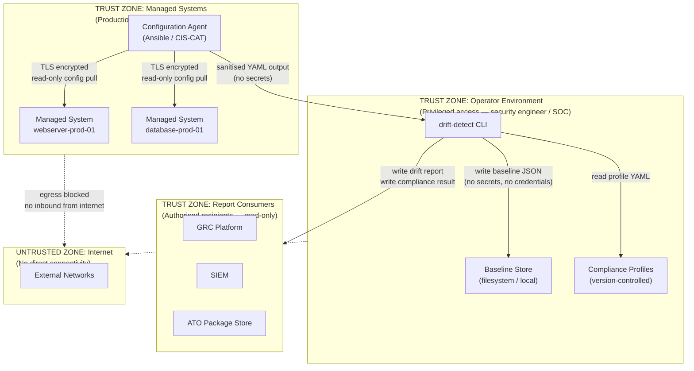

# Trust Boundaries Diagram

<!-- SPDX-License-Identifier: Apache-2.0 -->
<!-- Copyright 2024 Aerlix Consulting -->

This diagram identifies the trust boundaries, data classification zones, and security controls applicable to the Secure Baseline Drift Detection system.

---

## Trust Boundary Definitions

| Zone | Classification | Access Controls |
|---|---|---|
| Operator Environment | Sensitive — Security Operations | MFA required, privileged access management (PAM), audit logging |
| Managed Systems | Sensitive — Production | Read-only configuration pull, no credentials stored by this tool |
| Report Consumers | Internal — Restricted | Role-based access in GRC/SIEM, reports do not contain secrets |
| Internet | Untrusted | No connectivity permitted from operator or managed system zones |

---

## Security Properties

### Data at Rest

| Asset | Classification | Protection |
|---|---|---|
| Baseline JSON files | Sensitive configuration state | Filesystem ACLs; no credentials or secrets stored |
| Compliance profiles | Internal policy | Version-controlled, read-only for most users |
| Drift reports | Sensitive findings | ACL-protected; shared only with authorised recipients |

### Data in Transit

| Channel | Protocol | Notes |
|---|---|---|
| Config agent → managed system | TLS (SSH/HTTPS) | Encrypted; agent uses read-only credentials |
| Config agent → CLI | Local file / pipe | No network transmission if local execution |
| CLI → GRC / SIEM | HTTPS | Reports delivered over encrypted channel |

---

## What This Tool Does NOT Handle

| Threat | Mitigation (Outside Scope) |
|---|---|
| Credential leakage in config files | Secrets should be removed from configuration before feeding to this tool; use secret scanning (e.g., truffleHog) |
| Baseline tampering | Store baselines in write-protected storage or Git with signed commits |
| Privilege escalation in config agent | Use least-privilege agent accounts; this tool only reads output |
| Replay of stale baselines | Include `captured_at` in report and enforce freshness checks in consuming systems |

---

## Compliance Notes

- The tool does **not** store or process credentials, secrets, or PII — it operates on configuration metadata only
- Baselines should be stored in version-controlled repositories with signed commits to provide tamper evidence (CM-2(2))
- Access to the baseline store should be restricted to security operations personnel (AC-3, AC-6)
- Drift reports constitute continuous monitoring evidence and should be retained per the organisation's records schedule (AU-11)
